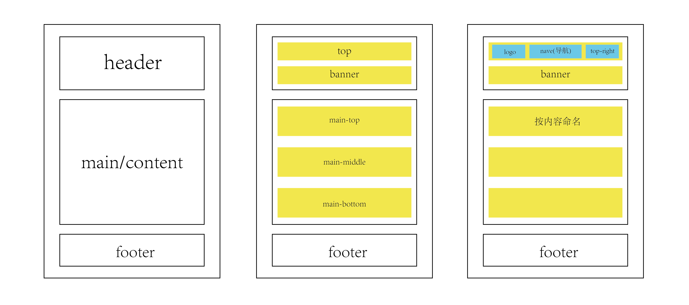

## html基础知识

- 参考网站：[w3school](http://www.w3school.com.cn/)

### 页面构成

头部（header）、主体（content/main）、底部（footer）

- 示意图



### html 语言（超文本标记语言）

> 构成：`<html>`html文档的起始标签、`</html>`html文档的结束标签、`<head></head>`html文档的`头部`的起始/结束标签
`<body></body>`html文档`主体`的起始/结束标签

浏览器所有可见内容在`<body></body>`中，html文档的头部内容在浏览器中不可见。

代码展示

```html
  <!DOCTYPE html>
  <html lang="en">
  <head>
    <meta charset="UTF-8">
    <title>寒叶笔记</title>
    <link rel="stylesheet" href="css/index.css">
    <link rel="icon" type="image/x-icon" href="https://luckyhanye.github.io/images/favicon.ico">

  </head>
  <body>
    <!-- 浏览器中展示内容部分 -->
  </body>
  </html>
```

### 元素分类

- 块元素  特点：独立成行，宽度自适应，标签可以直接嵌套，（`<p>`标签内不能套`<div>`）例如：`<div>`,`<p>`,`<ul>`, `table`等
- 行元素  特点：不独立成行，不能设置大小，标签内部不能嵌套行属性标签，例如：`<a>`,`<span>`,`<i>`等
- 行级块元素  特点：不独立成行，但是能设置大小(行元素通过`display:inline-block`可转换成)，例如：``
